<div align="center">

# Commit FM

**Your GitHub profile is a museum. This is a radio station.**

An animated SVG banner for your profile README that shows the repositories you are
actually working on right now, and the others in rotation, in seven retro skins.
Runs on GitHub Actions. No server, no API key, no model calls.


</div>

---

## Why

Stars, streaks and a language pie chart are all past tense. None of them tell a visitor
what you are building this week, which is the only thing they actually came to find out.

That is the same information problem a music player solves: one thing is playing, a queue
sits behind it, and one small display has to say so at a glance. So Commit FM borrows the
display. Repository name, one line about it, how warm the last push is, and the rest of
the rotation scrolling past.

It is built for busy profiles. If you have twenty repositories and four of them are alive
this month, a visitor currently has no way to tell which four.

## Skins

Pick one with `"style"` in your config. Every skin renders from the same data.

### terminal
cmus with a cava spectrum. Native to the audience reading a developer's profile. The bars
are real pushes per hour over the last 24, with a fast attack and a slow decay.


### splitflap
An airport departures board. The only skin that gets better the more repositories you have,
because more rows is what the object is for.


### dotmatrix
An amber LED destination sign. The one that can honestly represent private work: it prints
a count with no repository name attached.


### winamp
The classic skin, compressed into one strip. Loud, nostalgic, unmistakable.


### carradio
A tuner fascia where every repository is a station on the dial and the needle seeks between
them. The seven segment digits are drawn as paths, so nothing is embedded.


### vumeter
Analogue meter and a studio lamp. The needle steps to each reading and settles, because an
instrument that holds a value looks like it is measuring something.


### vinyl
The quiet one. Light ground, editorial type, one turning record and nothing else in motion.
For a profile that does not want to shout.


## Install

Two files and about a minute.

**1. Add `commitfm.json` to your profile repository** (the one named after your username).

```json
{
  "user": "YOUR-USERNAME",
  "style": "terminal",
  "theme": "auto"
}
```

**2. Add the workflow** at `.github/workflows/commit-fm.yml`. Copy it from
[`.github/workflows/commit-fm.yml`](.github/workflows/commit-fm.yml) in this repository.
It asks for one permission, `contents: write`, and nothing else.

**3. Put the banner in your README.**

```markdown

```

Run the workflow once by hand from the Actions tab and the banner appears. After that it
refreshes on its own and commits only when something actually changed.

No token to create. No account anywhere. Nothing to configure beyond those three steps.

> A note on the numbers. GitHub's public events endpoint reports that a push happened, not
> how many commits were in it: the documented payload carries only `before`, `head`,
> `push_id`, `ref` and `repository_id`, and the optional counters come back empty on real
> accounts. So Commit FM counts **pushes**, and says pushes. It would be easy to print a
> commit count nobody can verify, and it would be wrong.

## Configuration

```json
{
  "user": "OthmanAdi",
  "style": "terminal",
  "theme": "auto",
  "exclude": ["a-repo-nobody-needs-to-see"],
  "pin": ["the-one-i-want-first"]
}
```

| Key | Meaning |
| --- | --- |
| `user` | Whose activity to read |
| `style` | One of the seven skin ids above |
| `theme` | `light`, `dark`, or `auto` |
| `exclude` | Repository names to keep off the banner entirely. Applied last, after every other rule |
| `pin` | Repository names to put at the front of the rotation |

## Let an agent take the microphone

Commits tell a visitor what finished. They cannot tell anyone what is happening right now,
and increasingly the thing happening right now is an agent working on your behalf.

So the banner has a second lane. An agent writes one line into `commitfm.json`:

```bash
commit-fm say "refactoring the hook dispatcher" --repo margin --ttl 90
```

```json
{
  "broadcast": {
    "repo": "margin",
    "note": "refactoring the hook dispatcher",
    "by": "claude-opus-5",
    "at": "2026-09-06T06:10:00Z",
    "ttlMinutes": 90
  }
}
```

The banner shows that instead of the derived description, and marks itself live. When the
note passes its time to live it is ignored and the banner falls back to push history on
its own, so a forgotten line cannot still claim you are hard at work three weeks later.

`say` and `clear` only edit the file. They never touch the network and never run git, so
the tool cannot push anything on your behalf.

## What installing this does **not** do

Something agent controlled that renders on your public profile is exactly the shape you
should be suspicious of. So here is the answer before you have to ask for it.

One sentence has to stay true, and everything in the design exists to keep it true:
**installing Commit FM grants nobody access they did not already have, adds no secret,
opens no inbound endpoint, and spends no model tokens.**

- **No token to create.** The workflow uses the credential GitHub mints for each run and
  expires when the run ends. It requests `contents: write` and nothing else, in four lines
  you can read before you install it.
- **No server.** The banner is a static file committed to your own repository. There is no
  endpoint holding your data, so there is nothing to breach and nobody to trust.
- **The agent lane adds no permission.** An agent writes a file in a repository it can
  already write to. One that could not do that before still cannot. Uninstalling is deleting
  the file, and `git log` is a complete, attributable record of every claim any agent made.
- **Zero model calls.** Nothing here asks a model to summarise, rewrite or invent anything.
- **Private repositories need three independent failures to leak a name.** The default
  endpoint cannot return them at all. Private work appears only as GitHub's own server side
  aggregate count with no name attached, and only if you already enabled that on your own
  profile. An explicit `exclude` list runs after both.
- **The image has no active content by construction.** No scripts, no foreign objects, no
  external references. A hostile repository description can print text and nothing else.
  Every render is checked at the boundary before it is written.
- **No dependencies.** Not one. The whole thing is plain Node with the standard library,
  and third party actions are pinned by commit SHA rather than by a tag somebody can move.

See [SECURITY.md](SECURITY.md) for the detail, including how untrusted text is handled.

## Local use

```bash
npx commit-fm render --style terminal --user YOUR-USERNAME --out commit-fm.svg
npx commit-fm styles      # list the seven
npx commit-fm doctor      # check your config and report what is wrong
```

## Development

```bash
git clone https://github.com/OthmanAdi/commit-fm
cd commit-fm
node --test test/          # no install step, there is nothing to install
node scripts/render-examples.mjs
```

Style modules are pure functions of state: no network, no clock, no randomness. That is a
hard rule, because a workflow commits the output and a nondeterministic renderer would
produce a commit on every scheduled run forever.

See [CONTRIBUTING.md](CONTRIBUTING.md).

## Licence

MIT. See [LICENSE](LICENSE).
